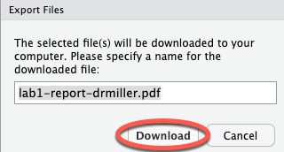

```{r setup, include=FALSE}
knitr::opts_chunk$set(echo = TRUE)
```

# Introduction

The data set `tuition_sample.csv` contains information about yearly cost of attendance, yearly cost of room and board, and yearly total cost of attendance (tuition + room and board) for 300 sampled public and private colleges and universities around the United States. 

In this lab, you will produce numerical and graphical displays to help you answer questions about the differences in tuition between private and public colleges.

**Collaborators:** If applicable, replace this text with the names of anyone you collaborated with on this project.

# Lab Assignment

## Question 0

In the chunk below, import ("read in") the data in `tuition_sample.csv` and call it `tuition`. Don't forget the `stringsAsFactors` argument. Hint: We read in the penguins data in the lab tutorial.

```{r question0, error = T}
# Use this code chunk to write the code necessary to answer the question. Do not start your code on this line, and do not start your code with # (this is a comment, R will ignore it).


```

## Question 1

a.  Create a histogram of in-state tuition for the colleges in the sample. Be sure to add a title and labels for the axes. Also provide the arguments `main`, `xlab`, and `ylab` for a plot title, x-axis label, and y-axis label.
b.  Create a histogram of out-of-state tuition for the colleges in the sample. Be sure to add a title and labels for the axes. Also provide the arguments `main`, `xlab`, and `ylab` for a plot title, x-axis label, and y-axis label.

```{r question1, error = T}
# Use this code chunk to write the code necessary to answer the question. Do not start your code on this line, and do not start your code with # (this is a comment, R will ignore it).


```

## Question 2

a.  Find and report the appropriate measure of center for in-state tuition from this data set.
b.  Find and report the appropriate measure of center for out-of-state tuition from this data set.
c.  Are these values parameters or statistics?

Use the code chunk below to run the code you need. Then answer the questions after the code chunk.

```{r question2, error = T}
# Use this code chunk to write the code necessary to answer the question. Do not start your code on this line, and do not start your code with # (this is a comment, R will ignore it).


```

*Replace this text with your answers to Question 2.* 

## Question 3

Make a side-by-side boxplot of the quantitative variable in-state tuition by the categorical variable institution type.

```{r question3, error = T}
# Use this code chunk to write the code necessary to answer the question. Do not start your code on this line, and do not start your code with # (this is a comment, R will ignore it).


```

## Question 4

Make a side-by-side boxplot of the quantitative variable out-of-state tuition by the categorical variable institution type.

```{r question4, error = T}
# Use this code chunk to write the code necessary to answer the question. Do not start your code on this line, and do not start your code with # (this is a comment, R will ignore it).


```

## Question 5

Run the following code chunk so that you can see the summary statistics for in-state and out-of-state tuitions by type of institution.

```{r}
#Remove the # at the beginning of each of the code lines so that this function runs on the data
#tapply(tuition$in_state_tuition, tuition$type, summary)

#tapply(tuition$out_of_state_tuition, tuition$type, summary)

```

Does it appear that institution type (private, public) has an effect on in-state tuitions? On out-of-state tuitions? Be sure to address aspects of what you see in the side-by-side boxplots from Questions 3 and 4 and to the output from the code chunk above to support your answers.

# Answer
*Replace this text with your answer to Question 5.*


<hr />
# Wrap-Up and Submission

At the top of the document, make sure you've changed the `author` field to your name (in quotes!) and the `date` field to today's date.

When you've finished the lab, click the **Knit** button one last time.<br />

{width="75%"}

Give yourself a high five - you just wrote code!

### Submission instructions

```{=html}
<!-- This is a comment and will not show up in your document. Note that the
numbering here is all 1's. This will automatically be converted to 1, 2, etc.
when you knit the document; writing all 1's makes it so you don't have to
constantly update the numbering when you move things around in editing! -->
```
1.  In the Files pane, check the box next to your `lab1report.pdf`: </br>

{width="50%"}

2.  Click More &rarr; Export... </br>

{width="50%"}

</br>

3.  Click Download and save the file on your computer in a folder you'll remember and be able to find later. You can just call the file `lab1-report.pdf` or whatever else you'd like (as long as you remember what you called it).

{width="50%"}

## Accessing Gradescope

You can access Gradescope through Canvas:

{width="75%"}

## Submit Lab Report to Gradescope

-   Click on the assignment name (e.g., Lab 1 Report).
-   Click Submit PDF &rarr; Select PDF &rarr; locate the file &rarr; Upload PDF. You can only submit one PDF file per assignment.
-   On your screen, you should see a list of the questions/problems in your assignment and thumbnails of your PDF page(s). For each question, click the question on the left and the PDF page(s) that contains the answers on the right.
-   Now, click Submit. When your submission is successful, you will be sent to a new page to view your submission, you’ll see a success message on your screen, and you’ll receive an email. If your submitted file looks good, you see the success message, and you get the confirmation email, you’re done!
-   If you need to, select the Resubmit button in the bottom right corner of your screen below your submission. Then, repeat the steps above as many times as needed before the assignment due date passes. We will only see your most recent submission when we grade your lab report. All your past submissions are in your Submission History.