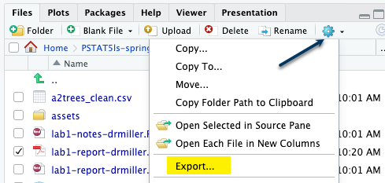
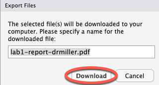

```{r setup, include=FALSE}
knitr::opts_chunk$set(echo = TRUE)
library(stats250sbi)
```

# Lab Notes and Code

You can follow along with the lab below. The code chunks have the code that your TA will be running during the lab tutorial. Just press play to follow along!

## Setting a Seed

Run the `setSeed` code chunk. No output will occur, but it will set the seed. 

```{r setSeed, error = T}
set.seed(8362)
```

We chose the number 8362 arbitrarily.

If you execute the code chunk that contains the `set.seed()` code again, it will start your random number generator at the beginning of the sequence.

When you knit your document, it will also start your random number generator at the beginning of the sequence.

## `simulate_chance_model()`

In order to understand our new function, let's utilize the help feature.

```{r tryIt1, error = T}
# Run this code chunk to generate the help feature for the `simulate_chance_model()` function
?simulate_chance_model
```

When running a simulation, think of a "success" as answering yes to a particular question. For example, a "success" in the Doris and Buzz example occurs when Buzz pushes the correct button. Likewise, a "success" in the rock-paper-scissors example occurs when scissors are thrown. 

## Simulation Example

Lee is a teacher at a local high school who wanted to assess whether or not dogs physically resemble their owners enough for people to be able to correctly match a dog to their owner better than if just guessing. Lee, who is also a dog owner, showed pictures of two dogs to her class of 26 students. One photo was of the teacher's dog (Yoda) and the other photo was of a dog the teacher had never met. The students were asked to guess which dog was actually the teacher's. If dogs do not physically resemble their owners, the students would get a correct match with probability 0.50, since the students would be equally likely to choose either dog. It turned out that 24 of the 26 students correctly picked out the teacher's dog.

Let's go through the entire procedure from start to finish.

## Sample Proportion

What is $\hat{p}$, the observed (sample) proportion of correct guesses?

```{r samp prop, error = T}
# Replace "number of successes" and "sample size" in the code block below and then run this chunk to calculate the sample proportion 
# phat <- (number of successes)/(sample size)
phat <- 24/26
phat
```


## Hypotheses

What are the hypotheses to be tested? State the hypotheses using symbols. Be sure to define the parameter. You'll want to define both $H_0$ and $H_a$.

$H_0$: *Write your answer here*

$H_A$: *Write your answer here*

where *write your symbol here* represents the *write your answer here*.

## Setting Up the Simulation
|                   | **Assuming the chance model...** |
|-------------------|----------------------------------|
| One draw          | *Write your answer here*         |
| Blue poker chip   | *Write your answer here*         |
| Yellow poker chip | *Write your answer here*         |
| Chance of blue    | *Write your answer here*         |
| One repetition    | *Write your answer here*         |

## Small Number of Repetitions

Let's try this out for a small number of repetitions, say, 10, so that we can see what the output is from the function. \scriptsize

```{r simulate1, echo = FALSE}
simulate_chance_model(chanceSuccess = 0.5, numDraws = 26, numRepetitions = 10)
```

\normalsize

The output is a vector of the simulated proportions, the simulated $\hat{p}$ values, under the chance model specified.

If we are going to simulate 100 times, 1000 times, 10000 times, we don't want to see the long output! So in the future, we will assign the output to a variable name so that we don't have to read pages and pages of output.

**NOTE: We reserve the right to deduct a point from your lab project should you print the contents of the entire simulation vector. Always check your knitted document before submitting!**

## Code to Simulate
Let's try this code out in the `tryit2` code chunk. to run the simulation 100 times.

```{r tryIt2, error = T}
# Run this code chunk to run the simulation, and assign it to the name sim1
sim1 <- simulate_chance_model(chanceSuccess = 0.5, 
                              numDraws = 26, 
                              numRepetitions = 100)
```

`sim1` should now be in your environment in the top right corner.

Notice that the first time you run this code, you get the **exact same values** we got! This is because we both set the same seed! If you run the code again, your values will change and will differ from ours. This is because the number of times that you run your code dictates where your random number generator is in the sequence of random numbers.

**Pro Tip:** Use your **knitted** document's output to view the first set of random numbers being generated!

## Making a Visualization of the Simulation Results

So, if we assigned the output to a variable name, how do we view the results?

Make a histogram!

We will make a histogram of this *quantitative* variable `sim1`. In our histogram, we will introduce a new argument called `xlim` that will allow us to set the minimum and maximum values on the *x*-axis. Since proportions are always between 0 and 1, setting these values as the minimum and maximum is a safe bet. Feel free to change these values at your discretion.

We will also make a vertical red line at the sample proportion. What was that value?

## Histogram Code

Let's try this code out in the `tryit3` code chunk.

```{r tryIt3, error = T}
# Run this code chunk to create a histogram of the simulated proportions, and include a red vertical line at the value of the observed sample proportion
hist(sim1, 
     main = "Histogram of 100 Simulation Results",
     xlab = "Simulated Proportion of Correct Guesses",
     xlim = c(0, 1))
abline(v = 24/26, col = "red")
```

## Finding the Probability of Getting This or More Extreme

As we learned in lecture, we are interested in the *probability that we will get our observed* $\hat{p}$ of 24/26 or a result that is even more extreme.

Since $H_a: p > 0.5$, the "as or more extreme" is actually **greater than or equal to**.

Let $A$ represent something of interest to us. In this example, an observation in $A$ is a simulated proportion of 24/26 or greater. The number of observations in $A$ is the sum of the simulated proportions that are 24/26, 25/26, or 26/26. To find the probability of $A$ in general, we use this formula: $$p(A) = \frac{\textrm{number of observations of A}}{\textrm{total observations}}$$ \

## Finding the Probability of Getting This or More Extreme

So we will be:

1.  looking for the number of observations that have a simulated proportion of 24/26 **or greater**
2.  divide this number of observations by **100**, the number of times we ran the simulation

## Code to Find this Probability

You can try this out in the `tryit4` code chunk.

```{r tryIt4, error = T}
# Run this code chunk to find the probability of getting the sampled results or more extreme
sum(sim1 >= 24 / 26) / 100
```

Let's break this down:

-   **`sim1`** is the numeric variable representing a vector of the 100 simulation proportions
-   the **`>=`** operator allows us to find things that are greater than or equal to 24/26 in the `sim1` variable
-   the `sum()` function will add up the number of observations that meet this criteria. So here, it will find the number of observations of simulation proportions that are greater than or equal to 24/26
-   divide the result of `sum()` by the total number of times the simulation was run

## So What is the Probability?

The probability of getting our observed sample proportion of 24/26 **or greater** is estimated to be 0.

What does this tell us about our observed sample proportion?

Is it *rare* or *not all that rare*?

*Write your answer here*


## Conclusion

What do the results tell us about our research question?

Do we have enough evidence to support the claim that dogs physically resemble their owners enough for people to be able to correctly match a dog to their owner **better** than if just guessing?

*Write your answer here*

# Code Cheat Sheet

## `set.seed(seed)`
Sets the "seed" of R's random number generator. After setting the seed, the sequence of random numbers R will produce is entirely determined/predictable. This is useful for ensuring you get the same results whenever you knit your code.

- `seed` is an integer. The seed you want to set.

## `simulate_chance_model(chanceSuccess, numDraws, numRepetitions)`
- `chanceSuccess`: a number between 0 and 1 represending the probability of observing a "success"
- `numDraws`: the number of times to draw a poker chip from the bag needed to coplete one repetition of the simulation
- `numRepetitions`: the number of times to repeat the simulation process

## `abline(linear_model_name)`
- Will plot the line found in `linear_model_name`
- Use `v = value` to print a vertical line

## Important plotting arguments

### `main = "Title of Your Graph in Double Quotes"`
- graph title that must be inside a set of double quotes

### `xlab = "x-axis Label of Your Graph in Double Quotes"`
- the x- (horizontal) axis label that must be inside a set of double quotes

### `ylab = "y-axis Label of Your Graph in Double Quotes"`
- the y- (vertical) axis label that must be inside a set of double quotes

# Reminder about Submission to Gradescope

At the top of the document, make sure you've changed the `author` field to your name (in quotes!) and the `date` field to today's date. 

When you've finished the lab, click the **Knit** button one last time.<br />


Give yourself a high five - you just wrote code! 

### Submission instructions
<!-- This is a comment and will not show up in your document. Note that the
numbering here is all 1's. This will automatically be converted to 1, 2, etc.
when you knit the document; writing all 1's makes it so you don't have to
constantly update the numbering when you move things around in editing! -->

1. In the Files pane, check the box next to your `lab1report.pdf`: </br>
  
  

2. Click More > Export... </br>

   </br>

3. Click Download and save the file on your computer in a folder you'll remember and be able to find later. You can just call the file `lab1-report.pdf` or whatever else you'd like (as  long as you remember what you called it). 

</br>


## Submission to Gradescope

- Access Gradescope through Canvas


## Submit to Gradescope Continued

- Click on the assignment name (e.g., Lab 1 Report). 
- Click Submit PDF > Select PDF > locate the file > Upload PDF. You can only submit one PDF file per assignment. 
- On your screen, you should see a list of the questions/problems in your assignment and thumbnails of your PDF page(s). For each question, click the question on the left and the PDF page(s) that contains the answers on the right.
- Now, click Submit. When your submission is successful, you will be sent to a new page to view your submission, you’ll see a success message on your screen, and you’ll receive an email. If your submitted file looks good, you see the success message, and you get the confirmation email, you’re done!
- If you need to, select the Resubmit button in the bottom right corner of your screen below your submission. Then, repeat the steps above as many times as needed before the assignment due date passes. We will only see your most recent submission when we grade your lab report. All your past submissions are in your Submission History.

# Installing the `stats250sbi` package 

1. Open up RStudio in JupyterHub and open the Console.
2. In the Console, type in this code: `install.packages(c("remotes", "checkmate"))`. Let R install these two packages. 
3. Once R has installed the `remotes` and `checkmate` package, you can type in this code in the Console:  `remotes::install_github("STATS250SBI/stats250sbi", dependencies = TRUE)`. Let R install this package.
4. Once R has installed the `stats250sbi` package, you can now run this R code: `library(stats250sbi)`. If creating an RMarkdown file, this code will need to be in one of the first chunks of your document. 
