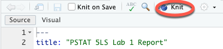

```{r setup, include=FALSE}
knitr::opts_chunk$set(echo = TRUE)
library(stats250sbi)
```

# Lab Notes

Use this place to take any notes during your lab section.

- Type any notes here
- Add new notes by using the dash `-` to create a list

# Lab Code

Run the chunks below to try out the code your TA is showing in class. 

```{r pelicans_part_a, error = T}
# Run this code to visualize the probability a California brown pelican has 
# a wingspan less than 5.75 feet
plot_norm(mean = 6.5, 
          sd = 0.5, 
          shadeValues = 5.75, 
          direction = "less", 
          col.shade = "cornflowerblue")
```

```{r pelicans_part_b, error = T}
# Run this code to visualize the probability a California brown pelican has 
# a wingspan more than 7.75 feet
plot_norm(mean = 6.5, 
          sd = 0.5, 
          shadeValues = 7.75, 
          direction = "greater", 
          col.shade = "cornflowerblue")
```

```{r pelicans_part_c, error = T}
# Run this code to visualize the probability a California brown pelican has 
# a wingspan between 5.5 and 7 feet
plot_norm(mean = 6.5, 
          sd = 0.5, 
          shadeValues = c(5.5, 7), 
          direction = "between", 
          col.shade = "cornflowerblue")
```

```{r cholesterol_1a, error = T}
# Run this code to visualize the percent of middle-aged men who have high 
# cholesterol (levels above 240 mg/dl)
plot_norm(mean = 222, 
          sd = 37, 
          shadeValues = 240, 
          direction = "greater",  
          col.shade = "cornflowerblue")
```

```{r cholesterol_1b, error = T}
# Run this code to calculate the percent of middle-aged men who have high 
# cholesterol (levels above 240 mg/dl)
pnorm(q = 240, 
      mean = 222, 
      sd = 37, 
      lower.tail = FALSE)
```

```{r cholesterol_2a, error = T}
# Run this code to visualize the percent of middle-aged men who have 
# elevated cholesterol (between 200 and 240 mg/dl)
plot_norm(mean = 222, 
          sd = 37, 
          shadeValues = c(200, 240), 
          direction = "between",  
          col.shade = "cornflowerblue")
```

```{r cholesterol_2b, error = T}
# Run this code to calculate the percent of middle-aged men who have 
# elevated cholesterol (between 200 and 240 mg/dl)
pnorm(q = 240, mean = 222, sd = 37, lower.tail = FALSE) - 
  pnorm(q = 200, mean = 222, sd = 37, lower.tail = FALSE)
```

```{r qnormChol1, error = T}
# Run this code to find one way to calculate the blood cholesterol level 
# for middle-aged men in the 95th percentile 
qnorm(p = 0.95, 
      mean = 222, 
      sd = 37, 
      lower.tail = TRUE)
```

```{r qnormChol2, error = T}
# Run this code to find another way to calculate the blood cholesterol 
# level for middle-aged men in the 95th percentile 
qnorm(p = 0.05, 
      mean = 222, 
      sd = 37, 
      lower.tail = FALSE)
```

# Code Cheat Sheet

## `plot_norm()` 

- `mean`: the mean of the normal distribution you'd like to draw ($\mu$)
- `sd`: the standard deviation or standard error of the normal distribution you'd like to draw ($\sigma$ or $\sqrt{\frac{p_0(1-p_0)}{n}}$, respectively)
- `shadeValues` (optional): either a number or a vector of two numbers (using `c()`) that are the boundaries of the region you'd like to shade.
- `direction`: where to shade (`"less"`, `"greater"`, `"between"`, or `"beyond"`)
- `col.shade`: the color to use when shading
- any other graphical parameters you want to use to control the appearance of the plot (like `main`, etc.)

## `pnorm(q, mean, sd, lower.tail = TRUE)`

- `q`: the x-axis value you want to find an area related to
- `mean`: the mean of the normal distribution, defaults to 0
- `sd`: the standard deviation of the normal distribution, defaults to 1
- `lower.tail` determines whether `pnorm()` finds the area to the left or right of `q`. If `lower.tail` is set to \textcolor{blue}{`TRUE`} (the default), it finds the probability to the \textcolor{blue}{LEFT}. If `lower.tail` is set to \textcolor{red}{`FALSE`}, it finds the probability to the \textcolor{red}{RIGHT}.

## `qnorm(p, mean, sd, lower.tail = TRUE)`

- `p`: the probability or area under the curve you want to find an x-axis value for
- `mean`: the mean of the normal distribution, defaults to 0
- `sd`: the standard deviation of the normal distribution, defaults to 1
- `lower.tail`: determines whether `qnorm()` finds the value of the variable with area `p` to its left or right. If `lower.tail` is set to \textcolor{blue}{`TRUE`} (the default), the area `p` is to the \textcolor{blue}{LEFT}. If `lower.tail` is set to \textcolor{red}{`FALSE`}, the area `p` is to the \textcolor{red}{RIGHT}.

## Important plotting arguments

### `main = "Title of Your Graph in Double Quotes"`
- graph title that must be inside a set of double quotes

### `xlab = "x-axis Label of Your Graph in Double Quotes"`
- the x- (horizontal) axis label that must be inside a set of double quotes

### `ylab = "y-axis Label of Your Graph in Double Quotes"`
- the y- (vertical) axis label that must be inside a set of double quotes

# Reminder about Submission to Gradescope

At the top of the document, make sure you've changed the `author` field to your name (in quotes!) and the `date` field to today's date. 

When you've finished the lab, click the **Knit** button one last time.<br />



Give yourself a high five - you just wrote code! 

### Submission instructions
<!-- This is a comment and will not show up in your document. Note that the
numbering here is all 1's. This will automatically be converted to 1, 2, etc.
when you knit the document; writing all 1's makes it so you don't have to
constantly update the numbering when you move things around in editing! -->

1. In the Files pane, check the box next to your `lab1report.pdf`: </br>
  
  