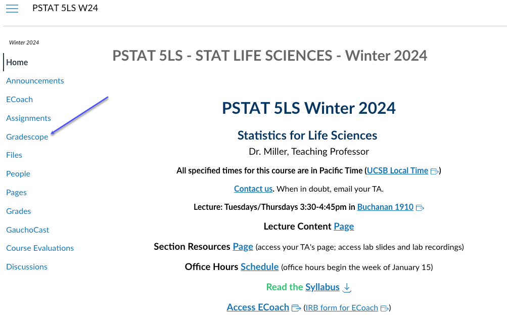

```{r setup, include=FALSE}
knitr::opts_chunk$set(echo = TRUE)
library(stats250sbi)
```

# Lab Notes

Use this place to take any notes during your lab section.

- Type any notes here
- Add new notes by using the dash `-` to create a list

# Lab Code

Use the chunks below to try out any code that you'd like. 

```{r tryIt1, error = T}
# Run this code chunk to read in birth.csv and call it babies
babies <- read.csv("births.csv", stringsAsFactors = TRUE)
```

```{r tryIt2, error = T}
# Run this code chunk to create a variable called ageDiff in the babies data
babies$ageDiff <- babies$fage - babies$mage
```

```{r tryIt3, error = T}
# Run this code chunk to create a histogram of the ageDiff variable
hist(babies$ageDiff, 
     main = "Histogram of the Differences in Age of the Father and Mother
     of Babies Born in North Carolina in 2004",
     xlab = "Difference of Age in Years", 
     col = "lightgreen")
```

```{r tryIt4, error = T}
# Run this code chunk to create a 90% confidence interval for the ageDiff variable
t.test(babies$ageDiff, 
       conf.level = 0.9)
```

```{r tryIt5, error = T}
# Run this code chunk to run a hypothesis test for the ageDiff variable
t.test(babies$ageDiff, 
       mu = 0,
       alternative = "greater")
```

```{r tryIt6, error = T}
# Run this code chunk to read in the penguins data
penguins <- read.csv("penguins.csv", stringsAsFactors = TRUE)
```

```{r tryIt7, error = T}
# Run this code chunk to subset the penguins data to only include Adelie and Chinstrap species
penguinsSubset <- subset(penguins,
                         species %in% c("Adelie", "Chinstrap"))
```

```{r tryIt8, error = T}
# Run this code chunk to create a histogram of flipper length for only the Adelie species
hist(penguinsSubset$flipper_length_mm[penguinsSubset$species == "Adelie"],
     main = "Histogram of Flipper Lengths of Adelie Penguins",
     xlab = "Flipper Length in mm",
     col = "darkorange1")
```

```{r tryIt9, error = T}
# Run this code chunk to create a histogram of flipper length for only the Chinstrap species
hist(penguinsSubset$flipper_length_mm[penguinsSubset$species == "Chinstrap"],
     main = "Histogram of Flipper Lengths of Chinstrap Penguins",
     xlab = "Flipper Length in mm",
     col = "mediumorchid2")
```

```{r tryIt10, error = T}
# Run this code chunk to run the hypothesis test for whether there is a difference in the average flipper lengths for Adelie and Chinstrap penguins
t.test(flipper_length_mm ~ species,
       data = penguinsSubset,
       alternative = "two.sided")
```

```{r tryIt11, error = T}
# Run this code chunk to create the 90% confidence interval for the difference in the average flipper lengths for Adelie and Chinstrap penguins
t.test(flipper_length_mm ~ species,
       data = penguinsSubset,
       conf.level = 0.95)
```

# Symbol Cheat Sheet

Inequality

$\neq 0$

Chi-square

$\chi^2$

Population means:

$\mu$

$\mu_d$

$\mu_1 - \mu_2$

$\mu_1$

$\mu_2$

Sample means:

$\bar{x}$

$\bar{x}_d$

$\bar{x}_1 - \bar{x}_2$

$\bar{x}_1$

$\bar{x}_2$

Curious to learn more about formatting math in RMarkdown? More or less, RMarkdown and Knitr use LaTeX formatting (pronounced "LAY-tech" or "LAH-tech") to produce math characters and expression, so most guides you read on typesetting math in LaTeX will also apply to Rmd. If you're interested (and to be clear, this is not required for any part of the course), I'd check out [this tutorial from Overleaf](https://www.overleaf.com/learn/latex/Mathematical_expressions) first. And here is a [pretty extensive cheatsheet for symbols](https://www.caam.rice.edu/~heinken/latex/symbols.pdf). 

# Code Cheat Sheet

## `pt(q, df, lower.tail = TRUE)`

- `q` is the x-axis value you want to find an area related to
- `df` is the degrees of freedom of the $t$ distribution
- `lower.tail` determines whether `pt()` finds the area to the left or right of `q`. If `lower.tail = TRUE` (the default), it shades to the left. If `lower.tail = FALSE`, it shades to the right.
  
## `qt(q, df, lower.tail = TRUE)`

- `p` is the probability or area under the curve you want to find an x-axis value for
- `df` is the degrees of freedom of the $t$ distribution
- `lower.tail` determines whether `pt()` finds the area to the left or right of `q`. If `lower.tail = TRUE` (the default), it shades to the left. If `lower.tail = FALSE`, it shades to the right.
  
## `plot_t()`

- `df` refers to the degrees of freedom of the distribution to plot. You must provide this value.
- `shadeValues` is a vector of up to 2 numbers that define the region you want to shade
- `direction` can be one of `less`, `greater`, `beyond`, or `between`, and controls the direction of shading between `shadeValues`. Must be `less` or `greater` if `shadeValues` has only one element; `beyond` or `between` if two
- `col.shade` controls the color of the shaded region, defaults to `"cornflowerblue"`
- `...` lets you specify other graphical parameters to control the appearance of the normal curve (e.g., `lwd`, `lty`, `col`, etc.)

## `t.test(x, alternative, mu, conf.level)`
- `x` is a vector of data values OR a formula of the form *variableOfInterest ~ group* for two-sample t-tests.
- `alternative` specifies the direction of the alternative hypothesis; must be one of "two.sided", "less", or "greater"
- `mu` indicates the true value of the mean (under the null hypothesis); defaults to 0
- `conf.level` is the confidence level to be used in constructing a confidence interval; must be between 0 and 1, defaults to 0.95

## Important plotting arguments

### `main = "Title of Your Graph in Double Quotes"`

- graph title that must be inside a set of double quotes

### `xlab = "x-axis Label of Your Graph in Double Quotes"`

- the x- (horizontal) axis label that must be inside a set of double quotes

### `ylab = "y-axis Label of Your Graph in Double Quotes"`

- the y- (vertical) axis label that must be inside a set of double quotes

# Reminder about Submission to Gradescope

At the top of the document, make sure you've changed the `author` field to your name (in quotes!) and the `date` field to today's date. 

When you've finished the lab, click the **Knit** button one last time.<br />


Give yourself a high five - you just wrote code! 

### Submission instructions
<!-- This is a comment and will not show up in your document. Note that the
numbering here is all 1's. This will automatically be converted to 1, 2, etc.
when you knit the document; writing all 1's makes it so you don't have to
constantly update the numbering when you move things around in editing! -->

1. In the Files pane, check the box next to your `lab1report.pdf`: </br>
  
  

2. Click More > Export... </br>

   </br>

3. Click Download and save the file on your computer in a folder you'll remember and be able to find later. You can just call the file `lab1-report.pdf` or whatever else you'd like (as  long as you remember what you called it). 

</br>


## Submission to Gradescope

- Access Gradescope through Canvas



## Submit to Gradescope Continued

- Click on the assignment name (e.g., Lab 1 Report). 
- Click Submit PDF > Select PDF > locate the file > Upload PDF. You can only submit one PDF file per assignment. 
- On your screen, you should see a list of the questions/problems in your assignment and thumbnails of your PDF page(s). For each question, click the question on the left and the PDF page(s) that contains the answers on the right.
- Now, click Submit. When your submission is successful, you will be sent to a new page to view your submission, you’ll see a success message on your screen, and you’ll receive an email. If your submitted file looks good, you see the success message, and you get the confirmation email, you’re done!
- If you need to, select the Resubmit button in the bottom right corner of your screen below your submission. Then, repeat the steps above as many times as needed before the assignment due date passes. We will only see your most recent submission when we grade your lab report. All your past submissions are in your Submission History.